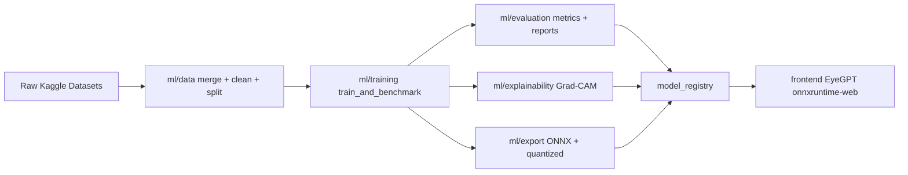

# EyeGPT-AI

EyeGPT-AI is a modular multi-architecture retinal disease AI system combining transfer learning and custom lightweight model design with explainable AI and browser-based deployment.

## Project Overview
- Multi-disease classes: Cataract, Glaucoma, Diabetic Retinopathy, Normal
- Transfer-learning benchmarks: EfficientNetB0, ResNet50, ViT (plus additional candidates)
- Custom lightweight architecture: EyeGPTNet (<5M params target)
- Explainability pipeline: Grad-CAM overlays (transparent PNG)
- Deployment path: ONNX + quantized ONNX + browser inference via `onnxruntime-web`

## Architecture Diagram


## Repository Structure
```text
EyeGPT-AI/
+-- ml/
¦   +-- data/
¦   +-- models/
¦   +-- training/
¦   +-- evaluation/
¦   +-- explainability/
¦   +-- export/
¦   +-- experiments/
¦   +-- utils/
+-- model_registry/
+-- frontend/
+-- docs/
+-- README.md
```

## Dataset Summary
- Merged and normalized to unified 4-class taxonomy.
- Quality filters include blur (Laplacian variance) and brightness checks.
- Input resized to `224x224`.
- Stratified split: `70% train / 15% val / 15% test`.
- Generated artifacts include:
  - `ml/experiments/phase1/dataset_summary.json`
  - `ml/experiments/phase1/class_distribution.png`

## Model Comparison Table
| Model | Accuracy | F1 | Params | Size (MB) | CPU(ms) |
|---|---:|---:|---:|---:|---:|
| EfficientNetB0 | pending | pending | pending | pending | pending |
| ResNet50 | pending | pending | pending | pending | pending |
| ViT | pending | pending | pending | pending | pending |
| EyeGPTNet | pending | pending | pending | pending | pending |

Populate from: `ml/experiments/phase2/model_comparison.csv`

## Explainability Visuals
- Grad-CAM code: `ml/explainability/gradcam.py`
- Example outputs folder: `docs/explainability/`
- Frontend overlay visualization: `frontend/src/components/ImagingPanel.jsx`

## Export + Deployment Benchmarks
- Export runner: `ml/export/export_models.py`
- Registry artifacts: `model_registry/`
- Benchmark JSON: `model_registry/model_performance_benchmark.json`

## Frontend Demo
```bash
cd frontend
npm install
npm run dev
```

## ML Commands
```bash
python ml/data/merge_and_normalize.py
python ml/data/clean_images.py --split-csv ml/experiments/phase1/splits/train.csv
python ml/training/train_and_benchmark.py --models EfficientNetB0 ResNet50 ViT EyeGPTNet
python ml/training/cross_validation.py
python ml/training/ablation_study.py
python ml/explainability/generate_examples.py
python ml/export/export_models.py
```

## Demo GIF
Add final demo at: `docs/demo.gif`

## Disclaimer
Educational and research project only. Not a medical device and not a clinical diagnostic system.
