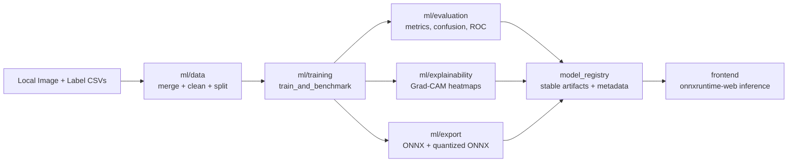
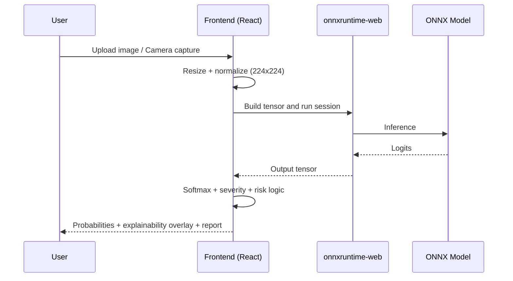

# EyeGPT-AI

EyeGPT-AI is a research-grade retinal disease AI project that evolved from a cataract-first prototype into a modular multi-disease system.

It covers:
- multi-class ophthalmology image classification
- model benchmarking (accuracy vs size vs latency)
- explainability (Grad-CAM overlays)
- ONNX export and browser inference integration
- production-style project structure for reproducibility

---

## What This Project Is
EyeGPT-AI is an end-to-end ML + frontend system, not just a single model script.

Core identity:
- **Legacy branch**: hand-trained anterior and fundus cataract models (`anterior_pipeline/`, `fundus_pipeline/`)
- **Current branch**: modular multi-disease pipeline in `ml/` with transfer learning, custom architecture (`EyeGPTNet`), explainability, and export tooling

Classes used in current multi-disease pipeline:
- Cataract
- Glaucoma
- Diabetic Retinopathy
- Normal

---

## System Architecture


## Runtime Flow


---

## Repository Structure
```text
EyeGPT-AI/
|-- ml/
|   |-- data/                 # dataset merge, cleaning, augmentation, quality
|   |-- models/               # EfficientNet/ResNet/ViT/ConvNeXt + EyeGPTNet
|   |-- training/             # benchmark training, cross-val, ablation, trainer utils
|   |-- evaluation/           # metrics, confusion matrix, ROC, performance benchmark
|   |-- explainability/       # Grad-CAM + heatmap export
|   |-- export/               # ONNX, quantization, export benchmarking
|   |-- experiments/          # generated artifacts (csv/json/plots/logs)
|   `-- utils/                # seed/config/logger
|-- model_registry/           # deployment-oriented model outputs + metadata
|-- frontend/                 # landing + analysis UI + browser inference
|-- docs/                     # architecture and supporting notes
`-- README.md
```

---

## Setup
### Prerequisites
- Python 3.10+
- Node.js 18+
- npm 9+

### Python environment
```powershell
python -m venv .venv
.\.venv\Scripts\activate
pip install -r requirements.txt
```

### Frontend dependencies
```powershell
cd frontend
npm install
cd ..
```

---

## Run Frontend
```powershell
cd frontend
node .\node_modules\vite\bin\vite.js
```
Open `http://localhost:5173/`

Features in UI:
- landing page + analysis workspace
- image upload and camera capture
- model probability chart + severity
- Grad-CAM overlay controls (toggle/opacity/zoom/compare)
- risk estimator
- PDF report download

### Modality, abstention, and calibration
- **Modality**: Choose *Fundus* or *Anterior* in the analysis page; inference uses the matching ONNX when available (`/models/fundus_multi_disease.onnx`, `/models/anterior_multi_disease.onnx`), else fallback.
- **Abstention**: Low confidence or low image quality triggers “Insufficient confidence – manual review recommended” instead of a definitive class; same logic in the Flask app (`eye_web`).
- **Calibration**: Run `python -m ml.training.calibrate_and_thresholds --weights <path> --model-name EfficientNetB0 --out model_registry/calibration.json` to fit temperature scaling and per-class thresholds on the val set.

---

## Data Pipeline
Input expectation:
- local manifests: `ml/experiments/dataset1_labels.csv`, `ml/experiments/dataset2_labels.csv`
- each CSV includes `image_path` and `label`

Run:
```powershell
python ml/data/merge_and_normalize.py --csv ml/experiments/dataset1_labels.csv ml/experiments/dataset2_labels.csv --out-dir ml/experiments/phase1
python ml/data/clean_images.py --split-csv ml/experiments/phase1/splits/train.csv
python ml/data/clean_images.py --split-csv ml/experiments/phase1/splits/val.csv
python ml/data/clean_images.py --split-csv ml/experiments/phase1/splits/test.csv
python ml/data/quality_analysis.py
```

Optional: use `--patient-id-column <column>` with `merge_and_normalize.py` so train/val/test splits are at **patient level** (no same patient in two splits).

Expected outputs:
- `ml/experiments/phase1/dataset_summary.json`
- `ml/experiments/phase1/class_distribution.png`
- `ml/experiments/phase1/quality_report_*.json`

---

## Training and Benchmarking
```powershell
python ml/training/train_and_benchmark.py --models EfficientNetB0 ResNet50 ViT EyeGPTNet
```

Per-model artifacts:
- `best_weights.pt`
- `metrics.json`
- `confusion_matrix.png`
- `roc_curve.png`
- `training_curve.png`

Aggregate artifact:
- `ml/experiments/phase2/model_comparison.csv`

### Modality-specific models
Train and export fundus and anterior experts:
```powershell
python -m ml.training.train_modality --modality fundus --data-dir ml/experiments/phase1_fundus/cleaned --output-dir ml/experiments/phase2_fundus
python -m ml.training.train_modality --modality anterior --data-dir ml/experiments/phase1_anterior/cleaned --output-dir ml/experiments/phase2_anterior
```
Or export from existing weights:
```powershell
python -m ml.export.export_modality_onnx --modality fundus --weights ml/experiments/phase2_fundus/EfficientNetB0/best_weights.pt
python -m ml.export.export_modality_onnx --modality anterior --weights ml/experiments/phase2_anterior/EfficientNetB0/best_weights.pt
```
Copy `model_registry/fundus_multi_disease.onnx` and `anterior_multi_disease.onnx` to `frontend/public/models/` for the UI.

### Benchmark table (fill from your runs)
| Model           | Accuracy | F1 (weighted) | ROC-AUC (ovr) | Notes   |
|-----------------|----------|---------------|---------------|---------|
| EfficientNetB0  | —        | —             | —             | default |
| ResNet50        | —        | —             | —             |         |
| ViT             | —        | —             | —             |         |
| EyeGPTNet       | —        | —             | —             | light   |

Run `python -m ml.evaluation.build_metrics_dashboard` to generate `frontend/public/metrics/benchmark.json` from `ml/experiments/phase2/`; the analysis page shows the metrics dashboard from that file.

### Historical note
- **Hand-trained legacy cataract models**: `anterior_pipeline/`, `fundus_pipeline/`
- **Fine-tuned multi-disease models**: current `ml/` modular pipeline

---

## Research Layer
```powershell
python ml/training/cross_validation.py
python ml/training/ablation_study.py
python -m ml.evaluation.external_validation --internal-metrics ml/experiments/phase2/EfficientNetB0/metrics.json --external-csv ml/experiments/external_test_labels.csv --weights ml/experiments/phase2/EfficientNetB0/best_weights.pt --out ml/experiments/external_validation_report.json
python -m ml.evaluation.reliability_tests
```
Outputs:
- `ml/experiments/phase3/crossval_results.csv`
- `ml/experiments/phase3/ablation_results.csv`
- `external_validation_report.json` (internal vs external accuracy/F1/ROC gap)

---

## Explainability
```powershell
python ml/explainability/generate_examples.py --images <img1> <img2> --out-dir docs/explainability
```
Outputs:
- transparent heatmaps in `docs/explainability/`

---

## Export and Registry
```powershell
python ml/export/export_models.py --best-model EfficientNetB0 --light-model EyeGPTNet
```

Outputs in `model_registry/`:
- best accuracy ONNX + quantized ONNX
- lightweight ONNX + quantized ONNX
- export benchmark JSON
- metadata for frontend/deployment

---

## Troubleshooting
### Vite command path issue on Windows
If `npm run dev` fails in paths containing special chars:
```powershell
node .\node_modules\vite\bin\vite.js
```

### Camera issues
- allow camera permission in browser
- use localhost/https
- close apps that may lock webcam

### ONNX fallback to mock
If model file is missing at configured path, frontend falls back to mock output.

---

## Screenshots and demos
Add screenshots or short GIFs to `docs/screenshots/` and link them here, for example:
- Analysis screen with result and Grad-CAM overlay
- Abstention banner when confidence is low
- Metrics dashboard with confusion matrix / ROC

---

## Limitations and safety boundaries
- **Not a medical device**: Outputs are for research and education only. Do not use for clinical diagnosis or treatment decisions.
- **Domain and data**: Models are trained on specific datasets; performance may drop on different imaging devices, populations, or pathologies. Use external validation to measure internal vs external gap.
- **Abstention**: Low confidence, low image quality, or modality mismatch triggers abstention (no definitive class). Always respect “manual review recommended” and do not override for clinical use.
- **Modality**: Fundus and anterior are separate models; use the correct image type. If the wrong modality is used, the system may abstain or report modality mismatch.
- **Explainability**: Grad-CAM highlights model attention only; it is not a substitute for clinical judgment and may be misleading on out-of-distribution images.

---

## Current Maturity
- Data pipeline: complete
- Benchmark/research framework: complete
- Explainability/export scaffolding: complete
- Frontend integration: functional
- Clinical readiness: **not applicable** (research-only project)

---

## Disclaimer
EyeGPT-AI is for educational and research use only.
It is **not** a medical device and must not be used for clinical diagnosis or treatment decisions.
