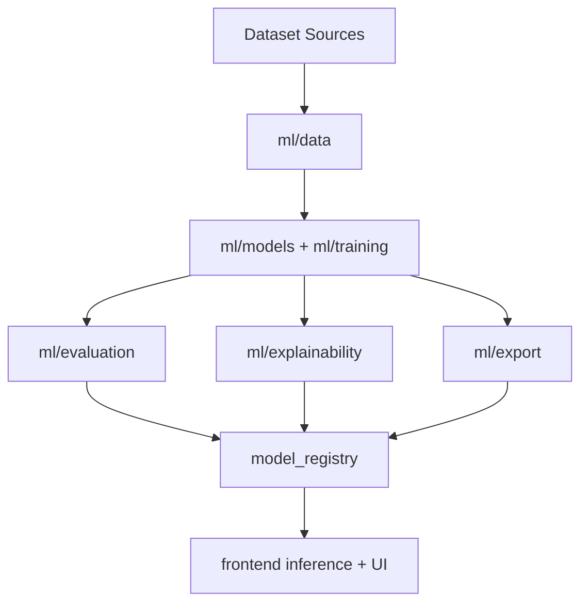

# EyeGPT-AI Architecture

## System Diagram

## Components
- `ml/data`: merge, normalize, quality filtering, split and summaries
- `ml/models`: transfer-learning backbones + custom EyeGPTNet
- `ml/training`: benchmark, cross-validation, ablation
- `ml/evaluation`: metrics, confusion, ROC, benchmark helpers
- `ml/explainability`: Grad-CAM and heatmap export tools
- `ml/export`: ONNX/quantized export and artifact benchmarking
- `model_registry`: stable deployment artifacts and metadata
- `frontend`: EyeGPT browser inference interface
